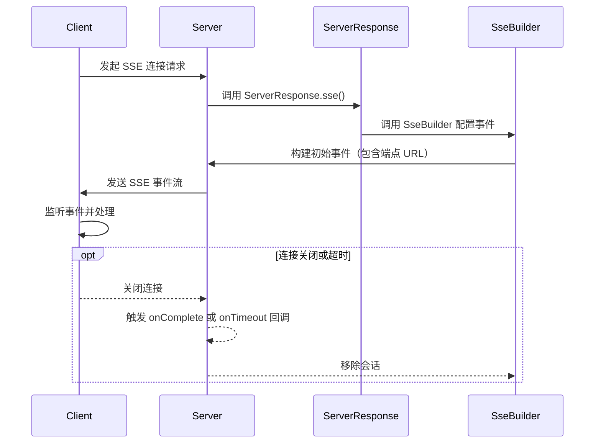

<think>
好的，我需要解释用户提供的代码中`ServerResponse.sse`方法的作用，以及`SseBuilder`如何将数据发送到客户端。

首先，用户的问题是关于Spring框架中处理Server-Sent Events (SSE)的。代码中的`handleSseConnection`方法处理SSE连接请求，返回`ServerResponse`。关键点在于`ServerResponse.sse`的使用和`SseBuilder`的配置。

我需要先回顾Spring的`ServerResponse.sse`方法，它用于创建一个SSE响应。`SseBuilder`则是构建SSE事件的构建器，允许配置事件流的各种行为，比如事件ID、事件类型、数据内容等。

用户可能想知道`ServerResponse.sse`如何生成SSE响应，以及`SseBuilder`如何将数据发送到客户端。可能需要解释SSE的基本工作原理，以及Spring框架中如何通过这些API实现。

代码中，`sseBuilder`被用来发送初始的ENDPOINT事件，其中包含消息端点的URL，可能用于后续的WebSocket或其他连接。此外，代码还处理了连接完成和超时的情况，移除会话。

需要详细解释`SseBuilder`的方法如`id()`, `event()`, `data()`的作用，以及事件如何被客户端接收。例如，`event()`设置事件类型，`data()`设置事件数据，`id()`设置事件ID，方便客户端重连时恢复位置。

另外，用户可能关心错误处理部分，比如`onComplete`和`onTimeout`回调如何工作，以及如何确保数据正确发送。

还要注意代码中使用`Duration.ZERO`作为参数的意义，可能表示立即开始发送事件，没有延迟。

可能需要举例说明SSE的事件格式，以及Spring框架如何通过`SseBuilder`构造这些事件，并通过HTTP流传输到客户端。

总结需要分步骤解释`ServerResponse.sse`的作用，`SseBuilder`的各个方法如何配置事件，以及数据传输的机制。

</think>

### **代码解析：`ServerResponse.sse` 方法的作用及 `SseBuilder` 数据传输方式**

这段代码是基于 **Spring WebFlux** 的 **Server-Sent Events (SSE)** 实现，用于建立与客户端的 **事件流连接**。以下是详细解释：

---

### **1. `ServerResponse.sse` 方法的作用**
`ServerResponse.sse` 是 Spring 提供的 **构建 SSE 响应的方法**，用于创建一个 **Server-Sent Events 流**。其核心作用是：
- **设置响应头**：自动设置 `Content-Type` 为 `text/event-stream`。
- **生成事件流**：通过 `SseBuilder` 构建具体的事件内容和行为。
- **管理连接生命周期**：通过 `onComplete` 和 `onTimeout` 处理连接关闭或超时。

#### **方法签名**
```java
public static ServerResponse sse(Consumer<SseBuilder> sseConsumer, Duration delay);
```

#### **参数说明**
- **`sseConsumer`**：一个 `Consumer<SseBuilder>`，用于配置事件流的构建逻辑。
- **`delay`**：延迟发送事件的时长（这里设置为 `Duration.ZERO` 表示立即开始发送）。

---

### **2. `SseBuilder` 的作用**
`SseBuilder` 是一个 **构建 SSE 事件的工具类**，允许开发者：
1. **定义事件属性**：如事件 ID、事件类型、数据内容。
2. **处理连接生命周期**：如连接关闭或超时。
3. **构建最终的 SSE 流响应**。

#### **关键方法**
| 方法               | 作用                                                                 |
|--------------------|----------------------------------------------------------------------|
| `id(String id)`    | 设置事件的唯一标识符（用于客户端重连时恢复位置）。                   |
| `event(String type)` | 设置事件类型（如 `message`、`endpoint` 等）。                       |
| `data(Object data)` | 设置事件携带的数据（会被序列化为字符串发送）。                       |
| `onComplete(Runnable)` | 定义连接关闭时的回调逻辑。                                      |
| `onTimeout(Runnable)` | 定义连接超时时的回调逻辑。                                       |

---

### **3. 代码详细解析**
以下是代码的逐行解析：

#### **(1) 检查服务器是否关闭**
```java
if (this.isClosing) {
    return ServerResponse.status(HttpStatus.SERVICE_UNAVAILABLE).body("Server is shutting down");
}
```
- **作用**：如果服务器正在关闭，返回 `503 Service Unavailable`。

#### **(2) 生成唯一 Session ID**
```java
String sessionId = UUID.randomUUID().toString();
logger.debug("Creating new SSE connection for session: {}", sessionId);
```
- **作用**：为每个连接生成唯一的 Session ID，并记录日志。

#### **(3) 构建 SSE 响应**
```java
return ServerResponse.sse(sseBuilder -> {
    // 配置 SseBuilder
}, Duration.ZERO);
```
- **`Duration.ZERO`**：立即开始发送事件，不延迟。

#### **(4) 配置 SseBuilder 生命周期回调**
```java
sseBuilder.onComplete(() -> {
    logger.debug("SSE connection completed for session: {}", sessionId);
    sessions.remove(sessionId);
});

sseBuilder.onTimeout(() -> {
    logger.debug("SSE connection timed out for session: {}", sessionId);
    sessions.remove(sessionId);
});
```
- **`onComplete`**：当客户端关闭连接时触发，清理会话。
- **`onTimeout`**：当连接超时时触发，同样清理会话。

#### **(5) 创建并注册会话**
```java
WebMvcMcpSessionTransport sessionTransport = new WebMvcMcpSessionTransport(sessionId, sseBuilder);
McpServerSession session = sessionFactory.create(sessionTransport);
this.sessions.put(sessionId, session);
```
- **作用**：
    - 使用 `SseBuilder` 创建会话传输对象 `WebMvcMcpSessionTransport`。
    - 通过 `sessionFactory` 创建会话并存储到 `sessions` 容器中。

#### **(6) 发送初始的 `ENDPOINT_EVENT_TYPE` 事件**
```java
try {
    sseBuilder.id(sessionId)
        .event(ENDPOINT_EVENT_TYPE)
        .data(this.baseUrl + this.messageEndpoint + "?sessionId=" + sessionId);
} catch (Exception e) {
    logger.error("Failed to send initial endpoint event: {}", e.getMessage());
    sseBuilder.error(e);
}
```
- **事件属性**：
    - **`id`**：设置事件的唯一 ID（`sessionId`）。
    - **`event`**：设置事件类型为 `ENDPOINT_EVENT_TYPE`（如 `"endpoint"`）。
    - **`data`**：发送包含会话 ID 的 URL（如 `https://api.example.com/messages?sessionId=abc123`）。
- **错误处理**：如果发送失败，调用 `sseBuilder.error(e)` 发送错误事件。

---

### **4. `SseBuilder` 如何将数据发送到客户端**
`SseBuilder` 通过以下步骤将数据发送到客户端：
1. **构建事件对象**：
   ```java
   sseBuilder.id(sessionId)
       .event("endpoint")
       .data("https://api.example.com/messages?sessionId=abc123");
   ```
    - **生成的事件格式**：
      ```text
      id: abc123
      event: endpoint
      data: https://api.example.com/messages?sessionId=abc123
 
      ```
      （每个字段后跟换行，事件末尾用双换行分隔）

2. **发送事件流**：
    - Spring 自动将 `SseBuilder` 配置的事件序列化为符合 SSE 格式的文本流。
    - 客户端（如浏览器）通过监听 `EventSource` 接收事件。

---

### **5. 完整 SSE 事件流示例**
假设 `ENDPOINT_EVENT_TYPE` 是 `"endpoint"`，发送的初始事件如下：
```text
id: abc123
event: endpoint
data: https://api.example.com/messages?sessionId=abc123

```
客户端会收到一个 SSE 事件，包含以下信息：
- **`id`**：用于重连时指定 `Last-Event-ID`。
- **`event`**：事件类型，客户端可过滤处理。
- **`data`**：实际数据内容（此处是消息端点的 URL）。

---

### **6. 关键代码流程**


---

### **7. 核心作用总结**
#### **`ServerResponse.sse` 的作用**
- **生成符合 SSE 协议的响应**：
    - 设置 `Content-Type: text/event-stream`。
    - 将 `SseBuilder` 构建的事件序列化为文本流。
- **管理连接生命周期**：
    - 通过 `onComplete` 和 `onTimeout` 处理资源清理。

#### **`SseBuilder` 的数据发送机制**
- **事件构建**：
    - 通过链式调用设置事件属性（`id`, `event`, `data`）。
    - 每个事件会被序列化为 SSE 格式的文本。
- **事件发送流程**：
    1. 调用 `data()` 方法时，事件会被立即发送。
    2. 客户端通过 `EventSource` 接收并处理事件。

---

### **8. 完整示例**
#### **客户端代码（JavaScript）**
```javascript
const eventSource = new EventSource("/sse-endpoint");

eventSource.addEventListener("endpoint", (event) => {
    const endpointUrl = event.data;
    console.log("Received endpoint URL:", endpointUrl);
    // 可在此处建立 WebSocket 连接或其他操作
});

eventSource.addEventListener("message", (event) => {
    const message = JSON.parse(event.data);
    console.log("Received message:", message);
});

eventSource.onerror = (error) => {
    console.error("SSE 连接错误:", error);
};
```

#### **服务端代码（关键部分）**
```java
// 发送初始 endpoint 事件
sseBuilder.id(sessionId)
    .event("endpoint") // 事件类型为 "endpoint"
    .data("https://api.example.com/messages?sessionId=" + sessionId);

// 后续发送 message 事件（示例）
sseBuilder.event("message")
    .data("{\"type\": \"login\", \"data\": {\"user\": \"Alice\"}}");
```

---

### **9. 关键点说明**
#### **(a) SSE 协议格式**
每个事件的格式如下：
```text
id: <event-id>
event: <event-type>
data: <event-data>

（双换行分隔事件）
```

#### **(b) 生命周期管理**
- **`onComplete`**：当客户端关闭连接时触发，清理会话。
- **`onTimeout`**：当连接超时时触发（需结合 Spring 的超时配置）。

#### **(c) 会话存储**
- **`sessions.put(sessionId, session)`**：将会话对象存储到 `sessions` 容器中，供后续消息处理使用。

---

### **10. 常见问题解答**
#### **Q1：如何发送多个事件？**
```java
sseBuilder.data("First message"); // 默认事件类型为 "message"
sseBuilder.event("custom").data("Custom event data"); // 自定义事件类型
```

#### **Q2：客户端如何重连？**
- **使用 `Last-Event-ID` 头**：
  ```javascript
  const eventSource = new EventSource("/sse-endpoint", {
      headers: { "Last-Event-ID": "abc123" } // 恢复之前的会话 ID
  });
  ```

#### **Q3：如何处理二进制数据？**
- **序列化为 Base64 字符串**：
  ```java
  byte[] data = ...;
  sseBuilder.data(Base64.getEncoder().encodeToString(data));
  ```

---

### **11. 完整代码流程**
1. **客户端发起 SSE 连接**：发送 GET 请求到 `/sse-endpoint`。
2. **服务端创建会话**：
    - 生成 Session ID。
    - 注册会话到 `sessions` 容器。
3. **发送初始事件**：
    - 发送类型为 `endpoint` 的事件，携带消息端点 URL。
4. **客户端处理事件**：
    - 接收 `endpoint` 事件，获取后续消息端点。
5. **连接保持活跃**：
    - 服务端可通过 `SseBuilder` 持续发送其他事件（如 `message`）。
6. **连接终止**：
    - 客户端关闭或超时后，服务端清理会话资源。

---

### **12. 代码中的潜在问题**
#### **问题 1：会话 ID 泄露**
- **风险**：Session ID 直接暴露在 URL 中，可能导致安全问题。
- **解决方案**：使用加密或 Token 化的 Session ID。

#### **问题 2：资源泄漏**
- **风险**：未正确处理异常可能导致会话未被移除。
- **解决方案**：在 `try-catch` 块外确保 `sessions.remove(sessionId)`。

---

### **13. 总结**
- **`ServerResponse.sse`**：生成 SSE 响应，管理事件流的生命周期。
- **`SseBuilder`**：构建事件属性（ID、类型、数据），并通过 HTTP 流发送到客户端。
- **核心逻辑**：通过 SSE 发送初始端点 URL，客户端根据该 URL 进一步交互（如建立 WebSocket 连接）。

通过这种方式，服务端可以 **实时推送事件**，并 **优雅地管理连接生命周期**。